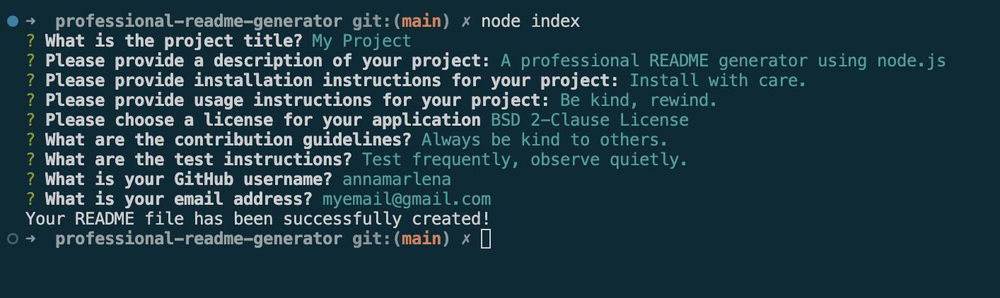
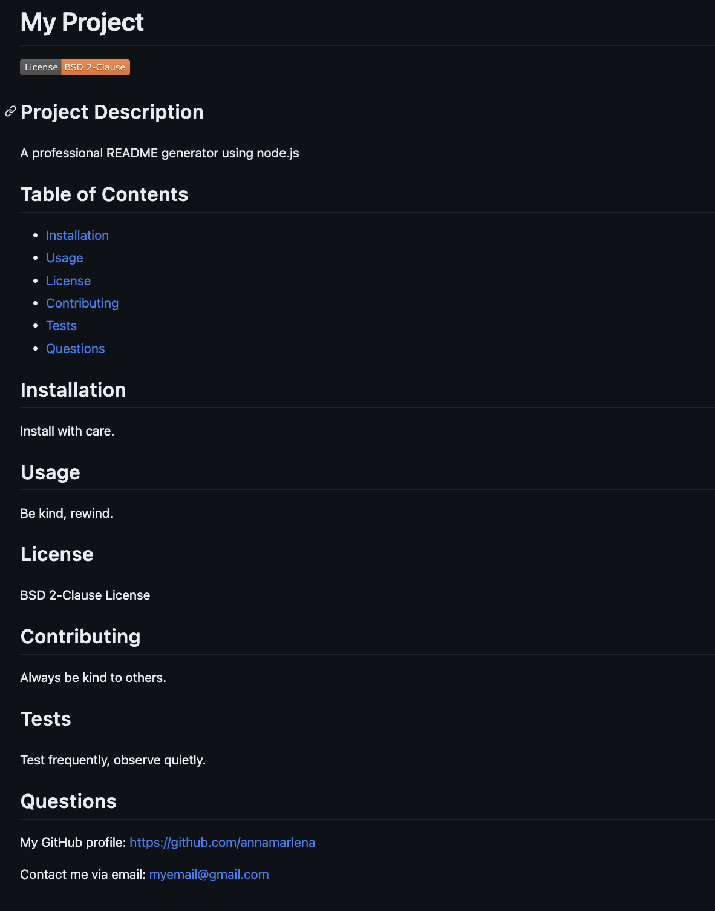

# Professional README Generator

## Objective

The objective of this project was to create a command-line application that dynamically generates a professional README.md file from a user's input. The final README file includes a Table of Contents with links to the contents, a dynamically generated badge to the license that was selected, and links to the project creator's GitHub and email. 

## Link to Video Demonstration

Click to watch a video demonstration. [https://drive.google.com/file/d/18G9PxsK69AlFUu3nWDCd5wtOn4gRMUy2/view](https://drive.google.com/file/d/18G9PxsK69AlFUu3nWDCd5wtOn4gRMUy2/view)

## Screenshot

